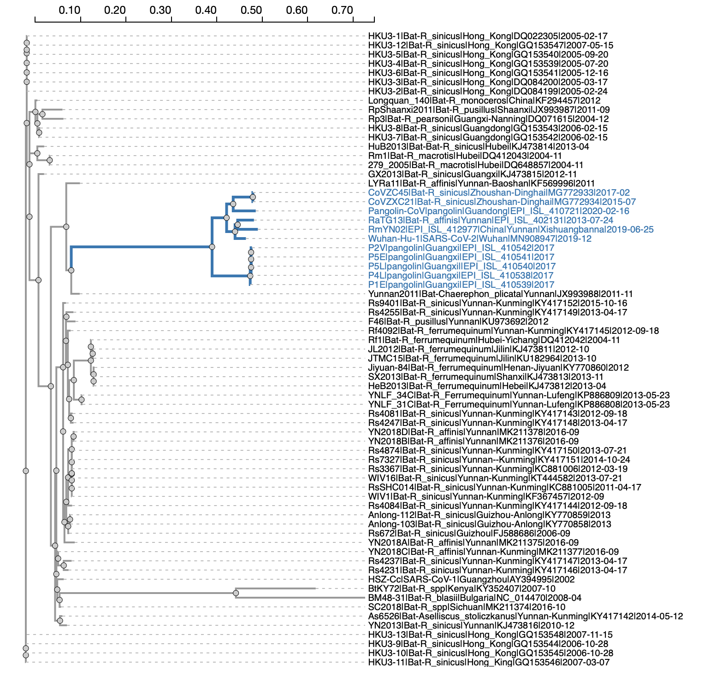

### Annotated SARS-CoV-2 genomes

The file `comparative-annotaton.json` contains evolutionary annotations of the SARS-CoV-2 genome at codon-level using the coordinates from the [NCBI reference genome for SARS-CoV-2](https://www.ncbi.nlm.nih.gov/nuccore/1798174254). It is a `JSON` file that contains evolutionary annotation for sites in the viral genome. Not all sites will have all attributes, but here's a fully annotated example with detailed explanations below.

```

	"22660": {
	  "G": "S",
	  "S": 367,
	  "bFEL": {
	   "a": 0.8239068005406807,
	   "b": 0,
	   "p": 0.3075029962432552
	  },
	  "bCFEL": {
	   "p": 0.0004897422991556599,
	   "a": 0.8239914716320671,
	   "b-nCOV": 0.3833558186862925,
	   "b": 0
	  },
	  "bMEME": {
	   "p": 0.6666666666666666,
	   "a": 0.8245929242388752,
	   "b+": 0.8168114351675718,
	   "w+": 1.110223024625157e-16,
	   "b-": 0,
	   "w-": 0.9999999999999999,
	   "br": 0
	  },
	  "bSC2": "GTC",
	  "bSC2-aa": "V",
	  "bcdn": {
	   "nCOV": {
	    "GTT": 3,
	    "GTC": 3,
	    "GTA": 5
	   },
	   "others": {
	    "GTT": 40,
	    "GTA": 9,
	    "GTG": 4,
	    "GCT": 2,
	    "GTC": 2,
	    "ATA": 1
	   }
	  },
	  "baa": {
	   "nCOV": {
	    "V": 11
	   },
	   "others": {
	    "V": 55,
	    "A": 2,
	    "I": 1
	   }
	  },
	  "evo": {
	   "GTT": 0.1175876874242563,
	   "GTC": 0.7369558478055803,
	   "GTA": 0.1021370049253975,
	   "GTG": 0.03824206960806418,
	   "GCT": 0.0001991710860313638,
	   "ATA": 0.0002441131048234254,
	   "ATC": 0.00177121436633351,
	   "ATG": 3.647217695043269e-05,
	   "ATT": 0.0002809762442199449,
	   "CAC": 1.046901762698883e-06,
	   "CTA": 2.506977932703428e-06,
	   "CTC": 1.822220360824723e-05,
	   "CTT": 2.907329154565415e-06,
	   "GAC": 8.360250239777524e-05,
	   "GAT": 1.309723352220331e-05,
	   "GCA": 0.0001730055761942231,
	   "GCC": 0.001248263297522743,
	   "GCG": 6.473542098590752e-05,
	   "GGA": 5.625682255051652e-05,
	   "GGC": 0.0004036572502156994,
	   "GGG": 2.09395277654519e-05,
	   "GGT": 6.440854160214541e-05,
	   "TTA": 2.710623507663667e-06,
	   "TTC": 0.0003329243217686022,
	   "TTT": 5.213867405605701e-05
	  },
	  "cdn": {
	   "GTC": 12695,
	   "TTC": 15
	  },
	  "aa": {
	   "V": 12695,
	   "F": 15
	  },
	  "FEL": {
	   "a": 0,
	   "b": 13.94180239492453,
	   "p": 0.009207690100683008
	  },
	  "MEME": {
	   "p": 0.01510855611334438,
	   "a": 0,
	   "b+": 13.93595248720851,
	   "w+": 0.99999999,
	   "b-": 0,
	   "w-": 1e-08,
	   "br": 2
	  },
	  "trend": -0.4859376114316813,
	  "subs": {
	   "cdn": {
	    "TTC|GTC": 2
	   },
	   "aa": {
	    "F|V": 2
	   },
	   "lcdn": {
	    "TTC|GTC": 1
	   },
	   "laa": {
	    "F|V": 1
	   }
	  },
	  "fubar": {
	   "a": 0.5900796034870954,
	   "b": 3.618455316349743,
	   "p+": 0.9296885283848362,
	   "p-": 0.055739171957308396,
	   "w": 14.593009456218418,
	   "wl": 0.3171992481203008,
	   "wu": 300.3356481481482
	  },
	  "hla": {
	   "CVADYSVLY": {
	    "6": 12694
	   },
	   "VADYSVLYN": {
	    "5": 12694
	   },
	   "SVLYNSASF": {
	    "1": 12693
	   }
	  }
	 }
 
```

### Fields expanations

* Top level key (`22660`, 1-based) is the site index (codon aligned, i.e. the 1st position of a codon) in the reference genome

* `G` - gene, which is S in this case

* `S` - site, 1-based, within the gene (`367`) in this case

* `bFel` The results of running the [FEL pervasive positive selection detection method](http://hyphy.org/methods/selection-methods/#fel) on the clade including the most closely related bat and pangolin isolates  (blue clade in the image below) in a larger tree based on the data from related beta-coronoviruses based on the [Boni et al](https://www.biorxiv.org/content/10.1101/2020.03.30.015008v1) preprint. All `b` prefixed keys in the records (for `beta-coronavirus`) indicate that the analysis was run on these data.
	1. `a` - the maximum likelihood estimate of the synonymous rate at this site 
	2. `b` - the maximum likelihood estimate of the non-synonymous rate at this site in the "close relatives" clade
	3. `p` - p-value that `a≠b`, i.e evolution is non-neutral




* `bMEME` The results of running the [MEME episodic positive selection detection method](http://hyphy.org/methods/selection-methods/#meme) on the clade including the most closely related bat and pangolin isolates.
	1. `a` - the maximum likelihood estimate of the synonymous rate at this site 
	2. `b-` - the maximum likelihood estimate of the negative/neutral non-synonymous rate at this site in the "close relatives" clade
	3. `b+` - the maximum likelihood estimate of the positive/neutral non-synonymous rate at this site in the "close relatives" clade
	4. `w+` - the inferred proportion for the `b+` rate
	5. 	`w-` - the inferred proportion for the `b-` rate
	6. `p` - p-value for epidosic positive selection at this site

* `bCFEL` The results of running the [Contrast-FEL differential positive selection detection method](http://hyphy.org/methods/other/contrast-fel/) to *compare* selective pressures between the clade including the most closely related bat and pangolin isolates and all others
	1. `a` - the maximum likelihood estimate of the synonymous rate at this site 
	2. `b-nCoV` - the maximum likelihood estimate of the non-synonymous rate at this site in the "close relatives" clade
	3. `b` - the maximum likelihood estimate of the non-synonymous rate at this site in the rest of the tree
	4. `p` - p-value for that selective pressures are different (`b≠b-nCoV`)

* `bSC2` The codon found in the reference SARS-CoV-2 sequence in this positon
* `bSC2-aa` The amino-acid found in the reference SARS-CoV-2 sequence in this positon
* `bcdn` All the codons found in the alignment of beta-coronaviruses in this position
	* `nCOV` - in the close relatives clade
	* `others` - in the rest of the tree
* `baa` All the amino-acids found in the alignment of beta-coronaviruses in this position
	* `nCOV` - in the close relatives clade
	* `others` - in the rest of the tree
* `evo` The list of codons and respective probabilities **imputed** for the SARS-CoV-2 sequences based on site-level PRIME models (documentation pending) fitted to this site. For example, at Spike 367, the most likely codon is `GTC` (which is the reference codon) with probablity of 73.6\% and the second most likely is `GTT` (11.8%)
* `cdn` - the distribution of codons at this site in the most recent GISAID sequences analyzed, conditioned on lentgh and quality filtering
* `aa` - the distribution of amino-acids at this site in the most recent GISAID sequences analyzed, conditioned on lentgh and quality filtering
* `FEL` - The results of running the [FEL pervasive positive selection detection method](http://hyphy.org/methods/selection-methods/#fel) on internal branches of the tree built from unique gene sequences found in GISAID.
	1. `a` - the maximum likelihood estimate of the synonymous rate at this site 
	2. `b` - the maximum likelihood estimate of the non-synonymous rate at this site in the "close relatives" clade
	3. `p` - p-value that `a≠b`, i.e evolution is non-neutral
	
* `MEME` - The results of running the [MEME episodic positive selection detection method](http://hyphy.org/methods/selection-methods/#meme) on internal branches of the tree built from unique gene sequences found in GISAID.
	1. `a` - the maximum likelihood estimate of the synonymous rate at this site 
	2. `b-` - the maximum likelihood estimate of the negative/neutral non-synonymous rate at this site in the "close relatives" clade
	3. `b+` - the maximum likelihood estimate of the positive/neutral non-synonymous rate at this site in the "close relatives" clade
	4. `w+` - the inferred proportion for the `b+` rate
	5. 	`w-` - the inferred proportion for the `b-` rate
	6. `p` - p-value for epidosic positive selection at this site
	
* `FUBAR` - The results of running the [FUBAR pervasive positive selection detection method](http://hyphy.org/methods/selection-methods/#fubar) on the entire tree built from unique gene sequences found in GISAID.
	1. `a` - posterior mean of the synonymous rate at this site 
	2. `b` - posterior mean of the non-synonymous rate at this site 
	3. `p+` - posterior probability of positive selection (b>a) at this site
	4. `p-` - posterior probability of negative selection (b<a) at this site
	4. `w` - posterior mean of dN/dS (condtioned on a≠0)
	5. 	`wl` - lower bound of the 95% hpd set (very crude)
	6. `wu` - upper bound of the 95% hpd set (very crude)
	
* `subs` Inferred substitutions (tree is unrooted, so no direction should be assumed) at this site
	* `lcdn` : codon substitutions on terminal branches
	* `laa`: amino-acid substitutions on terminal branches
	* `cdn` : codon substitutions on internal branches
	* `aa`: amino-acid substitutions on internal branches

* `trend` Z-score for the [Jonckheere–Terpstra](https://en.wikipedia.org/wiki/Jonckheere%27s_trend_test) trend test that the minor allele frequency at the site (if present). Positive values of sufficiently magnitude (e.g. > 2) : increasing frequency.

* `hla` CTL epitopes that include this site, and sequence count carrying those alleles, based on the computational prediction of epitopes described in [Campbell et al](https://www.biorxiv.org/content/10.1101/2020.03.30.016931v1.abstract)